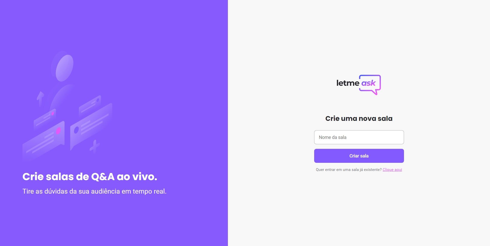
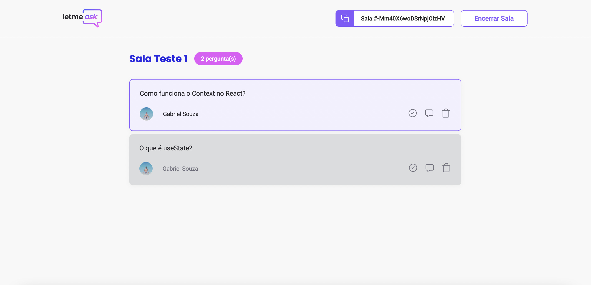

# About This

Letmeask é um projeto para criadores de conteúdos poderem criar salas de Q&A com o seu público. O projeto permite que o usuário faça login com sua conta do Google e crie uma sala que contém perguntas que podem ser respondidas por outros usuários. As mesmas também podem ser curtidas, marcadas como favorita e excluídas. O usuário criador da sala também pode encerrar a sala quando sentir que sua dúvida foi respondida de forma correta.

# Technologies

- [React](https://reactjs.org)
- [TypeScript](https://www.typescriptlang.org/)
- [Sass](https://sass-lang.com)
- [Firebase Authentication](https://firebase.google.com/docs/auth)
- [Firebase Realtime Database](https://firebase.google.com/docs/database)
- [Firebase Hosting](https://firebase.google.com/docs/hosting)

# How to Execute

Clonar o projeto e acessar a pasta:

```bash
$ git clone https://github.com/gsouza97/NLW-6-React
$ cd NLW-6-React
```

Iniciar o projeto:

```bash
# Instalando as dependências:
$ yarn

# Iniciando o projeto:
$ yarn start
```

Em seguida acessar http://localhost:3000 no navegador.

# Improvements

Ainda trabalhando...

# Layout

O layout do projeto está disponível no Figma e você pode visualizar pelo link abaixo:

- [Layout Letmeask Figma](https://www.figma.com/community/file/1009824839797878169)

# Media

<div>
 



</div>
